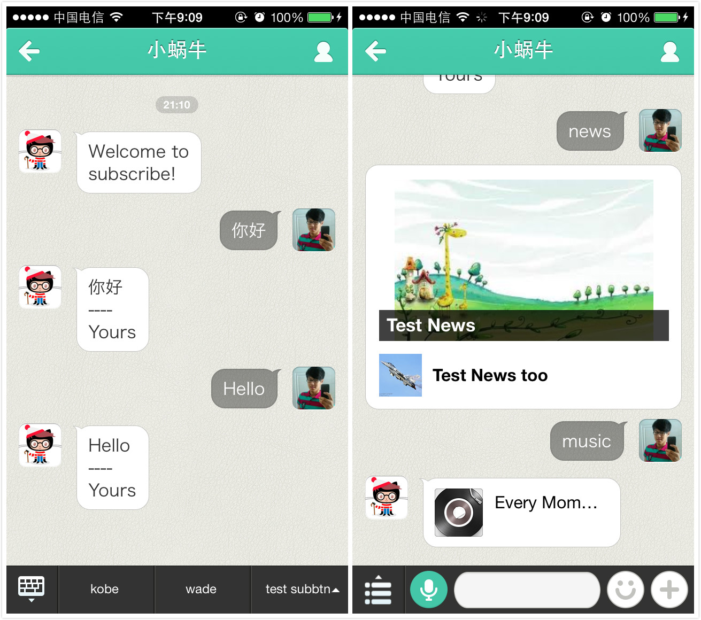
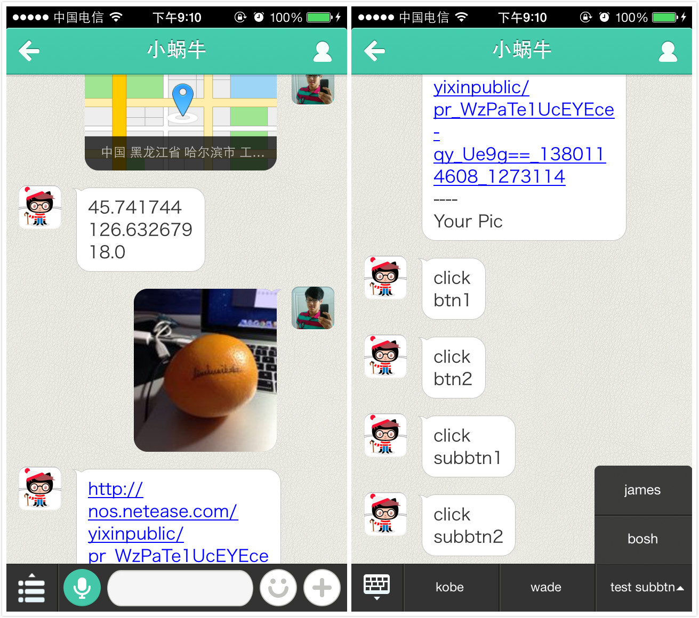

yixin
=====

易信公众平台接口服务SDK。

## 安装
让你的代码能找到lib即可。    
For example:
``` python
import sys
libpath = '/home/user/lib'
if libpath not in sys.path:
	sys.path.append(libpath)
```
## 使用

1. 用`Token`、`AppID`、`AppSecret`新建一个`YiXin`对象，接下来大部分操作都是基于这个对象，可以把它设置为一个全局的变量。  

	``` python
	TOKEN = 'lovezlp'
	AppID = 'ca2c526a88744b5e98c0ac548de22725'
	AppSecret = '0b331b59196141caa5dcb00df2f73fa9'

	yixinApp = yixin.YiXin(TOKEN, AppID, AppSecret)
	```
2. 处理易信平台对开发者填写的url的校验。      
	`YiXin`类中包含一个方便的方法，用于处理这个请求，一般来说，易信在开发者设置url的时候就会进行校验（详见文档）。

	``` python
	result = yixinApp.checkSignature(signature, timestamp, nonce, echoStr)
	```
	开发者获取这个result后，返回给客户端即可完成校验。
3. SDK中提供了丰富的回调接口，用于处理用户发送的各种类型的消息。     
	目前支持的消息类型包括：

	1. 文本消息
	2. 图片消息
	3. 地理位置消息
	4. 事件推送(自定义菜单接口事件推送、关注与取消关注事件推送)

	``` python
	# 定义回调函数
	def receivedTextMsgCallback(msgType, msg):
		# do some stuff...
		pass
	def receivedPicMsgCallback(msgType, msg):
		# do some stuff...
		pass
	def receivedLocationMsgCallback(msgType, msg):
		# do some stuff...
		pass
	def userSubscribeCallback(msgType, msg):
		# do some stuff...
		pass
	def userUnSubscribeCallback(msgType, msg):
		# do some stuff...
		pass
	def buttonClickCallback(msgType, msg):
		# do some stuff...
		pass
	# 注册回调函数
	yixinApp.setOnTextMsgReceivedCallback(receivedTextMsgCallback)
	yixinApp.setOnPicMsgReceivedCallback(receivedPicMsgCallback)
	yixinApp.setOnLocationMsgReceivedCallback(receivedLocationMsgCallback)
	yixinApp.setOnButtonClickCallback(buttonClickCallback)
	yixinApp.setOnUserSubscribeCallback(userSubscribeCallback)
	yixinApp.setOnUserUnsbscribeCallback(userUnSubscribeCallback)
	```
4. 给用户回复消息。      
	可以给用户回复的消息包括：      

	1. 文本消息
	2. 音乐消息
	3. 图文消息

	SDK中提供构造消息的方法，注意仅仅是构造消息，开发者需要在具体的环境下将构造好的消息回复给用户，具体可参考本SDK在Django1.4中使用的[Example](https://github.com/liushuaikobe/yixin/tree/master/example)。

	``` python
	# 构造文本消息
	replyMsg = replyText(self, toUser, fromUser, content='')

	# 构造音乐消息
	replyMsg = replyMusic(self, toUser, fromUser, title, description, musicUrl, HQMusicUrl)

	# 构造新闻对象
	article1 = yixin.Article()
	article1.setTitle('Test News')
	article1.setDescription('Every moment of My Life.')
	article1.setPicUrl('http://219.217.227.89/1.jpeg')
	article1.setUrl('http://219.217.227.89/index.html')

	article2 = yixin.Article()
	article2.setTitle('Test News too')
	article2.setDescription('Need you now.')
	article2.setPicUrl('http://219.217.227.89/2.jpeg')
	article2.setUrl('http://219.217.227.89/index.html')

	artiles = [article1, article2]
	# 构造新闻消息
	replyMsg = replyNews(self, toUser, fromUser, articleCount, articles)
	```
5. 自定义菜单。       
	添加自定义菜单开发者只需要构造菜单对象，调用相应方法即可。注意：添加菜单只需要调用一次方法即可。

	``` python
	buttonGroup = yixin.ButtonGroup()

	# 普通的菜单里面的按钮（只有一级，没有子菜单）
	btn1 = yixin.CommonClickButton()
	btn1.setName('kobe')
	btn1.setKey('btn1')

	# 普通的菜单里面的按钮（只有一级，没有子菜单）
	btn2 = yixin.CommonClickButton()
	btn2.setName('wade')
	btn2.setKey('btn2')

	# 顶层按钮（按下将弹出子菜单）
	btn3 = yixin.TopLevelButton()
	btn3.setName('test subbtn')

	# 子菜单中的按钮
	subBtn1 = yixin.CommonClickButton()
	subBtn1.setName('james')
	subBtn1.setKey('subbtn1')

	# 子菜单中的按钮
	subBtn2 = yixin.CommonClickButton()
	subBtn2.setName('bosh')
	subBtn2.setKey('subbtn2')

	btn3.addSubButton(subBtn1)
	btn3.addSubButton(subBtn2)

	# 将按钮加入菜单组
	buttonGroup.addButton(btn1)
	buttonGroup.addButton(btn2)
	buttonGroup.addButton(btn3)

	# 添加自定义菜单，本方法只需调用一次
	yixinApp.addMenu(buttonGroup)
	```
6. 删除自定义菜单。       
	调用相应方法即可。

	``` python
	yixinApp.deleteMenu()
	```
	注意：可能由于易信的缓存，对菜单的操作不能立即看到效果

## 注意
1. 日志    
	在SDK中，log（`lib/log.py`）模块将log文件的路径设置成了：`/home/dev-user/yixin_log.txt`；    
	这是SDK开发者在开发时的路径，在使用时 **务必将其改为实际的log文件** ；    
	此外，还必须要将 **log文件的权限设置为可写** （`chmod`）。 
2. 本Repo中的Example      
	`view.py`中，lib的路径设置的也是SDK开发者在开发时的路径，要运行例子，也要将lib的路径修改为实际lib路径。
3. 与微信公众账号关系      
	就目前来看，易信公众账号的开放API是微信公众账号开放API的子集。也即易信公众账号已支持的API与微信的一模一样，稍加改动即可应用到微信公众账号。

## 期望添加的功能

- 简单的session支持
- 菜单查询（API已支持，但本SDK中未实现）

## 本Repo中Example




## License
The MIT License (MIT)

## 向作者捐助
如果你觉得本项目对你有用，欢迎请作者一杯茶。                
      
[](https://me.alipay.com/liushuaikobe)
